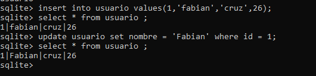
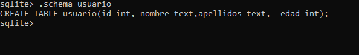
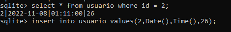
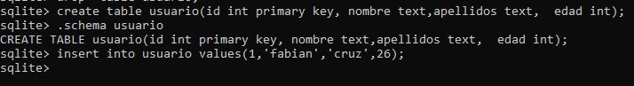
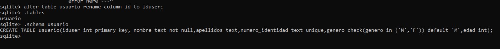
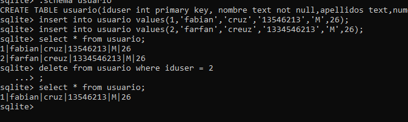
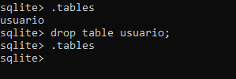

# SQLite

# Update 
es un comando DML(lenguage de manipulacion de datos) de Sqlite la cual tiene como propocito actualizar o modificar los registros existentes dentro de una tabla creada previamente
La sintaxis es la siguiente:
update <nombre tabla> set <nombre_columna> = <nuevo_dato> where <condicion_filtrar_columnas>;

# Schema 
.schema es un comando se sqlite que nos muestra la estructura de una tabla  en la cual nos va a retornar  como esta compuesta una tabla con todos su atributos y sus tipos de datos y propiedades.

# Date()
Estas funcion nos retorna la fecha actual 

# Time()
Esta funcion nos retorna la hora el minuto y el segundo actual en el que se llamo la funcion

# Primary Key
la llave primaria permite identificar un registro dentro de una tabla este pipo de dato, este es unico y no puede quedar vacio  ya que  es obligatorio su registro para identificar el registro de esta tabla  y poder consultar y acceder mas facil a estos datos
  
  

# Not Null
esta propiedad nos permite que el regitro de este campo o columna  no puede quedar vacio por lo que es obligatorio almacenar algun registro
  
# Unique 
Esta propiedad que se le da a una columna indica que este campo es unico  y no puede registrarse o almacenar mas registros con el mismo dato.

  
# Default
Esta propiedad  indica que los registros almacenados en esta columna  tienen un valor  predeterminado por lo tanto enel caso que nos se agregue un dato  este tomara el indicado previamente
  
# check  
Esta propiedad que se le atribuye a una columna o atributo  indica  cuales son los datos que son permitidos por ejemplo genero en el cual se le indica que los unicos datos que se pueden alamacenar por medio de condiciones.

  
# Alter table
Este es una palabre reservada el cual es un comando DDL  el cual esta configurada para realizar modificaciones a una tabla como el nombre el nobre de la tabla o los atributos de la tabla asi mismo como su tipo de dato  y sus propiedades.
  
  

# Delete
este es un comando DML el cual  elimina registros de una tabla en especifico ya sea todos los registro o añadiendo  alguna condicion para eliminar registros especificos
  
  

# Drop
Este es un comando DDL el cual su funcion es eliminar bases de datos vistas tablas funciones o disparadores este comando deve ser usado  con cuidado ya que este elmina por completo toda la informacion sin vuelta atras.

  
# BackUp, Restore
  
  
