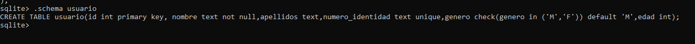

# SQLite

# Update 
es un comando DML(lenguaje de manipulación de datos) de Sqlite la cual tiene como propósito actualizar o modificar los registros existentes dentro de una tabla creada previamente
La sintaxis es la siguiente:
update <nombre tabla> set <nombre_columna> = <nuevo_dato> where <condicion_filtrar_columnas>;

# Schema 

.schema es un comando se sqlite que nos muestra la estructura de una tabla en la cual nos va a retornar como está compuesta una tabla con todos sus atributos y sus tipos de datos y propiedades.

# Date()
Esta función nos retorna la fecha actual 'aaaa/mm/dd'

# Time()
Esta función nos retorna la hora el minuto y el segundo actual en el que se llamó la funcion

# Primary Key
La llave primaria permite identificar un registro dentro de una tabla este pipo de dato, este es único y no puede quedar vacio, ya que es obligatorio su registro para identificar el registro de esta tabla y poder consultar y acceder más fácil a estos datos
  
  

  
# Not Null
Esta propiedad nos permite que el registro de este campo o columna no puede quedar vacío por lo que es obligatorio almacenar algún registro
  

  
# Unique 
Esta propiedad que se le da a una columna indica que este campo es único  y no puede registrarse o almacenar más registros con el mismo dato.

  

# Default
Esta propiedad indica que los registros almacenados en esta columna tienen un valor predeterminado por lo tanto en el caso que nos se agregue un dato este tomara el indicado previamente.
  

  
# check  
Esta propiedad que se le atribuye a una columna o atributo  indica  cuáles son los datos que son permitidos por ejemplo género en el cual se le indica que los únicos datos que se pueden almacenar por medio de condiciones.

  
# Alter table
Este es una palabra reservada el cual es un comando DDL  el cual está configurada para realizar modificaciones a una tabla como el nombre de la tabla o los atributos de la tabla así mismo como su tipo de dato y sus propiedades.
  
  

# Delete
Este es un comando DML el cual  elimina registros de una tabla en específico ya sea todos los registro o añadiendo  alguna condición para eliminar registros específicos
  
  

# Drop
Este es un comando DDL el cual su funcion es eliminar bases de datos vistas tablas funciones o disparadores este comando debe ser usado  con cuidado, ya que este elimina por completo toda la información sin vuelta atrás.

  
# BackUp, Restore
.backup este comando es usado para realiza un respaldo de toda la informacion de la base de datos y este se guarda en el directorio actual que se encuentre en el momento
.restore este comando  se usa para srestaurar la informacion guardada en la base de datos se le indica el nombre con el cual se realizo el backup y reestablece toda la informacion completa
  
  

